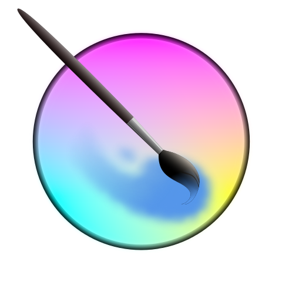

# Cloud Computer

The cloud computer is a one click deploy computer accessible through any web browser. It can be run on-premises, or on a cloud provider. It can be thought of as an open source [Citrix Receiver](https://user-images.githubusercontent.com/1094600/64485122-9f6da580-d25f-11e9-83a0-e6a63a9fe9fa.png).

## Supported Applications

|||||||
|-|-|-|-|-|-|
| VS Code | Blender | Chrome | Krita | Darktable | Slack |
|  |  |  |  |  | 
| Postman | KiCad | Notion | OnlyOffice | Terminal | Gnumeric |
|  |  |  |  |  | 
| Grafana ||||
| 

## Supported Storage

||||
|-|-|-|
| Drive | Dropbox | OneDrive | Krita | Darktable | Slack |
|  |  | 

## Getting Started

The cloud computer deploys with one command once cloud provider credentials are supplied.

1. Supply your cloud provider and domain name [configuration](#configuration).

2. Run `yarn create:cloud-computer`.

3. Open `https://terminal.your-domain.com` to access the terminal user interface or `https://desktop.your-domain.com` to access the desktop environment.

## Configuration

The cloud computer is hosted in the public cloud. This requires [credentials](infrastructure/credentials/cloud-provider.json) for creating cloud resources. Currently only Google Cloud Platform is supported.

The cloud computer is accessible via a URL. This requires a [domain name and credentials](infrastructure/dns/scripts/environment.sh) for configuring DNS. Currently only CloudFlare is supported.

## Technologies

The cloud computer is built on 100% open source technologies.

- [Docker](https://github.com/docker/docker-ce)
- [Git](https://github.com/git/git)
- [GoTTY](https://github.com/yudai/gotty)
- [Grafana](https://github.com/grafana/grafana)
- [Istio](https://github.com/istio/istio)
- [Jaeger](https://github.com/jaegertracing/jaeger)
- [Let's Encrypt](https://github.com/letsencrypt)
- [noVNC](https://github.com/novnc/noVNC)
- [Packer](https://github.com/hashicorp/packer)
- [Prometheus](https://github.com/prometheus/prometheus)
- [Terraform](https://github.com/hashicorp/terraform)
- [Tmux](https://github.com/tmux/tmux)
- [Traefik](https://github.com/containous/traefik)
- [TypeScript](https://github.com/Microsoft/TypeScript)
- [VS Code](https://github.com/codercom/code-server)
- [X11VNC](https://github.com/LibVNC/x11vnc)
- [Xvfb](https://www.x.org/releases/X11R7.6/doc/man/man1/Xvfb.1.xhtml)
- [Yarn](https://github.com/cloud-computer/yarn)
- [Zsh](https://github.com/zsh-users/zsh)

## Screenshots

